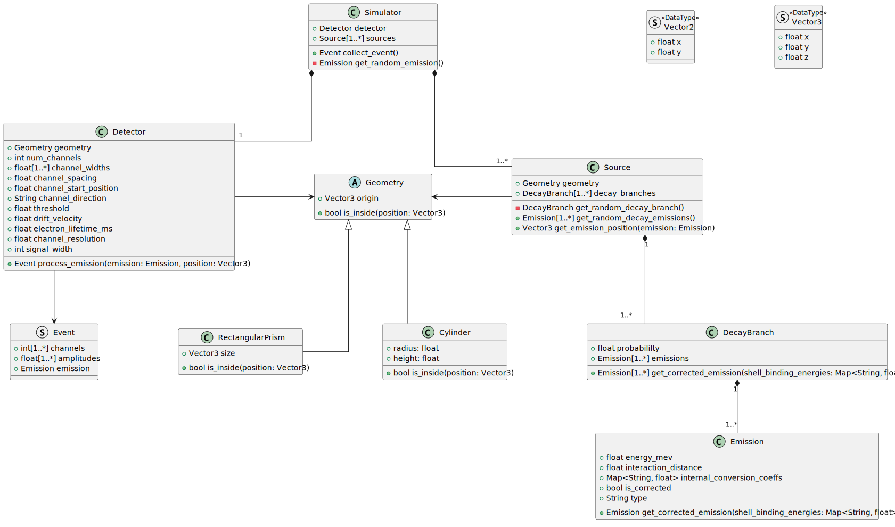

# LArTPC Radioactive Source Simulation `larradiosource`
This is a simulation package for radioactive sources in liquid argon time projection chambers (LArTPC).
The target of this simulation is to produce the charge response from a radioactive source.
The initial use-case of this package was for Bi-207 internal conversion decays, but the development into other decay schemes is left open.

## Detector Geometries Configuration
The focus of this simulation limits detector geometries to prism-like TPCs, such as cylinders and rectangular prisms.
It is expected that the two example geometries will be sufficient for most use cases for 1D channel coverage through radial extension or Cartesian extension.

## Decay Configuration
Decays branches are written according to their emissions and probability.
Each emission should have a type, e.g. `photon` or `electron`, an energy (MeV), and conversion coefficients in the case of IC.
Since the configuration is fully user-controlled, it is on the user to know these values and any calculations required to getting these values.

## Simulation Configuration
There are a few fields that are used by the top-level simulator, such as a save path, number of workers to spawn, number of emissions to create, and the names of the detector and source(s) to be used.
For scripting purposes, a few of these configurables are also CLI options.
