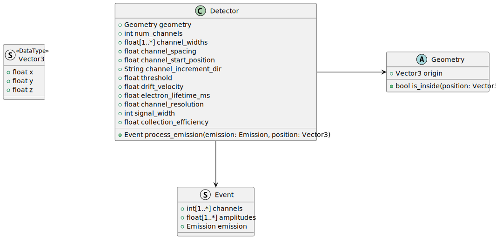

# `Detector` Configuration
The `Detector` class is primarily configured for its `Geometry`, readout channel layout, and some signal details.
The use of the `Geometry` class, and its configuration is given in [docs/configuration/geometry.md](geometry.md).
The rest of this section will focus on the `Detector` specific configurations.



## Readout Channel Layout
There are 3 supported directions for increasing channels (`channel_increment_dir`): `"x"`, `"y"`, and `"r"`.
The placement and sequence of channels is controlled by
* `num_channels`: An integer number of channels to produce.
* `channel_widths`: This is list of either size 1 for all equal widths or `num_channels` for varying widths.
* `channel_start_pos`: Where the first channel originates.
* `channel_spacing`: How separated each channel is from the other.

Currently, linear channels are infinite length.

## TPC Details
* `drift_velocity`: The TPC's electric field drift velocity, used in mm / us.
* `electron_lifetime_ms`: The electron lifetime in ms for the TPC.
* `channel_resolution_mev`: The readout channel resolution in MeV.
* `signal_width`: The number of readout samples used to construct an expected signal. Used to estimate the channel RMS contribution.
* `collection_efficiency`: The readout channel collection efficiency.


## Example Configuration
```toml
[detector]
num_channels = 100
channel_start_pos = 5.00
channel_widths = [2.5]
channel_spacing = 5.00
channel_increment_dir = "x"
threshold = 0.30
drift_velocity = 1.6
collection_efficiency = 0.95
electron_lifetime_ms = 10
signal_width = 8
channel_resolution_mev = 0.02
```
