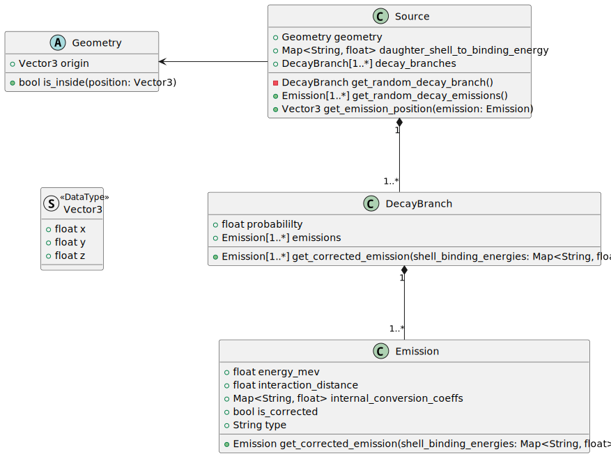

# Radiation Configuration
The `Source` class configuration requires a reasonable background on radioactive decay to effective configure an accurate source.
The use of Nuclear Data Sheets or similar is advised.

The `Source` class makes use of the `Geometry` class, and its configuration is given in [docs/configuration/geometry.md](geometry.md).
The rest of this section will focus on the `Source` specific configurations.



## `Emission` Configuration
Emissions are focused on internal conversions (IC).
Support for alternative emissions requires development.

* `energy_mev`: Energy of the emission in MeV
* `interaction_distance`: The mean interaction distance for photons.
* `internal_conversion_coeffs`: The IC coefficients for K, L, M, etc. shell emissions. Maps the shell char to a probability.
* `type`: The type of the emission. For ICs, this should be set to photon and allowing randomization from the IC coefficients.

## `DecayBranch` Configuration
Configuring a decay branch should have `Emission` configurations within it.

* `probabililty`: The probability for this decay branch.
* `emissions`: A list of the `Emission` configurations to use, appears as a map in the config TOML.

## `Source` Configuration
The remaining piece for the `Source` is the `daughter_shell_to_binding_energy`.
This is used to evaluate the adjustment from IC shell emissions from the daughter.
The configurable is a mapping from `"K"`, `"L"`, `"M"`, or `"N"` to floats for the MeV binding energy.


## Example Configuration
The following configuration is not based on a _real_ radioactive source; it is only meant as an example that is extensive for the purposes of configuration.
```toml
[fake_source]
decay_rate = 1000
daughter_shell_to_binding_energy = {K = 0.250, L = 0.125, M = 0.0625}

[fake_source.geometry]
type = "cylinder"
radius = 2.5
height = 0
origin = [0,0,0]

[[fake_source.decay_branches]]
probability = 0.5
emissions = [
	{type = "photon", energy_mev = 1.0, interaction_dist = 100, internal_conversion_coefficients = {K = 0.55}},
]

[[fake_source.decay_branches]]
probability = 0.5
emissions = [
	{type = "photon", energy_mev = 0.8, interaction_dist = 80, internal_conversion_coefficients = {K = 0.10, L = 0.05}},
	{type = "photon", energy_mev = 0.2, interaction_dist = 40, internal_conversion_coefficients = {K = 0.08, L = 0.01, M = 0.0002}},
]
```

There is a Bi-207 configuration available in [config/np04_simulation.toml](../../config/np04_simulation.toml).
